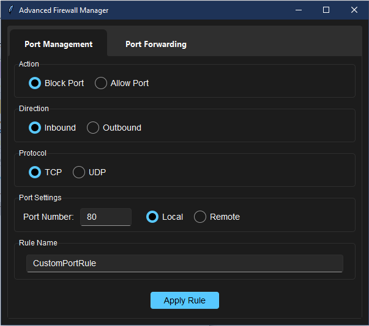

# Portman - Advanced Firewall Manager

 <!-- Add a screenshot if available -->

Portman is a modern graphical interface for managing Windows firewalls. It allows you to easily block and unblock ports, create firewall rules, and configure port forwarding. The programme is designed for users who want to easily manage the security settings of their system.

## Features

- Create and delete firewall rules based on selected parameters (port, protocol, direction, action)
- Port management: block or allow traffic on selected ports
- Configure port forwarding
- Friendly, modern graphical interface with support for Sun Valley styles (sv_ttk)

## Requirements

- Windows OS
- Administrator privileges (run the program as an administrator)
- Python 3. x
- Library `sv_ttk` (can be installed by `pip install sv_ttk`)

## Installation

1. Download the program source code.
2. Install the required library:
   ``bash
 pip install sv_ttk
 ```
3. Run the program as administrator to have access to all firewall functions.

## Using

When you start the application, you will see two main tabs:

### Port Management

- Allows you to block or unblock ports
- Select an action (block/unblock), direction (in/out), protocol (TCP/UDP)
- Enter a port number and range (local/remote)
- Enter a rule name and click *Apply Rule*

### Port Forwarding

- Allows port forwarding from a local IP address to another address and port
- Specify source port, destination IP address, destination port, protocol
- Optionally specify network interface
- Click *Setup Port Forwarding* to validate

## Notes

- The program requires administrator privileges to modify firewall settings and port forwarding.
- Port forwarding operation is based on the `netsh` utility and may require a reboot of the system or network services.
- Use with caution so as not to disrupt your system or network.


